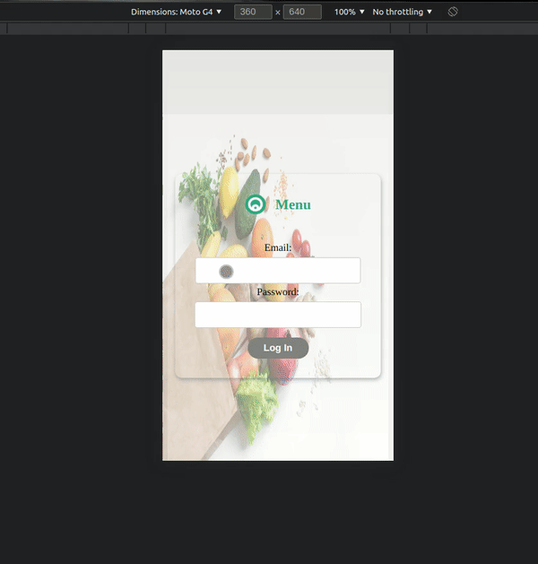
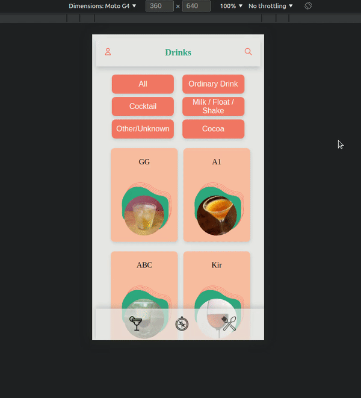
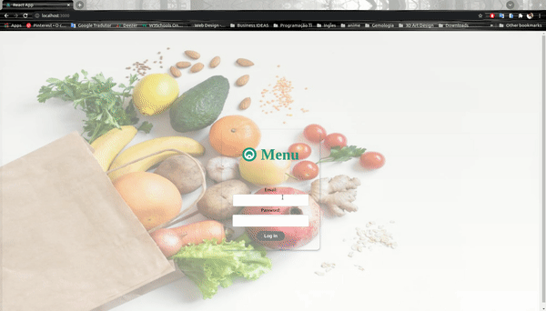
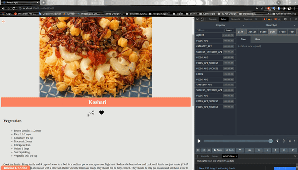
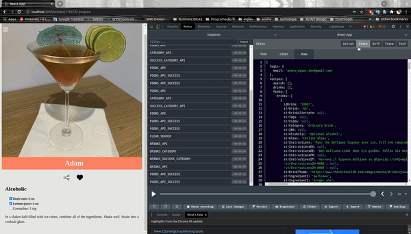
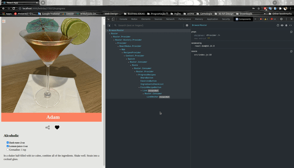

# 
 :zap: Bem Vindo ao Projeto Menu Recipe App! :zap:   O App mais delicioso do GitHub! 

---

## O Projeto:  :apple:

#### É um MVP de um App de Receitas. Ele foi desenvolvido para ajudar restaurantes e bares em suas receitas e drinks. Nele são consumidas duas API's (uma para comidas e outra para bebidas). 

### Seguem as telas do aplicativo:
 

### Login com Mobile:

 

 

### Percorrendo o app-mobile:

 

 

### Login e percorrendo app Web:

 

 

### Estruturação do Redux (escopo global) Stores, Reducers e Actions:

 

 

### Gráfico do Redux;

 

 

### Estruturação dos Providers e ContextAPI (escopo de components):

 

 
 

## Desenvolvimento :  :pencil:

### O projeto foi realizado em duas sprints de 5 dias. Utilizamos o Trello para aplicar o método ágil Kanban para nos organizarmos e dividirmos as tasks e requisitos do projeto. O Front-end do nosso projeto foi desenvolvido em React, onde em uma negociação entre a equipe, achamos mais viável para esse caso utilizar o gerenciamento de estado com o Redux e Redux-thunk na camada mais externa e o Context API (do próprio React), nas camas mais internas. A estilização foi feita com CSS Puro.

---

# Intruções para rodar o projeto  :pencil:

1. Clone o repositório
  * `git clone git@github.com:flaviocordeiro/menu-recipes-app.git`
  * Entre na pasta do repositório que você acabou de clonar:
    * `cd menu-recipes-app`

2. Instale as dependências e inicialize o projeto
  * Instale as dependências:
    * `npm install`
  * Inicialize o projeto:
    * `npm start`

---

# Protótipo do projeto :bulb:

Você pode acessar um protótipo no link abaixo:

em deploy

---

## :rocket: TECNOLOGIAS ADOTADAS:

React;

Context API com React Hooks; 

React Hooks Customizados (useLocalStorage);

Redux e Redux-thunk;

ESLint;

Jest e RTL;

Cypress;

---

## APIs

### TheMealDB API

O [TheMealDB](https://www.themealdb.com/) é um banco de dados aberto, mantido pela comunidade, com receitas e ingredientes de todo o mundo.

Os end-points são bastante ricos, você pode [vê-los aqui](https://www.themealdb.com/api.php)

### The CockTailDB API

Bem similar (inclusive mantida pela mesma entidade) a TheMealDB API, só que focado em bebidas.

Os end-points também são bastante ricos, você pode [vê-los aqui](https://www.thecocktaildb.com/api.php)

---

## Autores  :alien:

<a href="https://github.com/andrejaques">
 
  
  
 <b>André Jaques</b></a> <a href="https://github.com/andrejaques">
 🚀
</a> 

   
   
 <a href="https://github.com/flavioCoder1">
 
  
  
 <b>Flavio Cordeiro</b></a> <a href="https://github.com/flavioCoder1">
 🚀
</a>

  
  
 <a href="https://github.com/GabrielTakaki">
 
  
  
 <b>Gabriel Takaki</b></a> <a href="https://github.com/GabrielTakaki">
    🚀
</a>
 
 

Feito com :green_heart: por André Jaques , Flavio Cordeiro, Gabriel Takaki  

### Entre em contato! :sparkles:

 
 

---

## LICENSE  :pencil:

Esse projeto está protegido pelo MIT license. Veja aqui a LICENSE <link> aqui!
